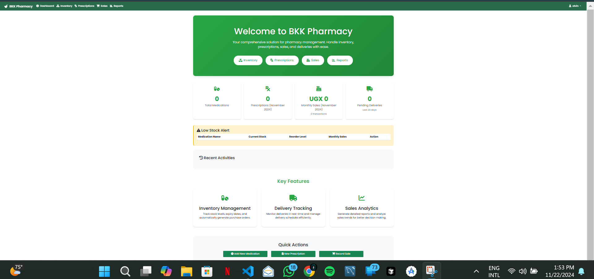

<div align="center">
  
  <h1>BKK Pharmacy Management System</h1>
  <p>Enterprise-grade pharmacy management solution by <a href="https://4codex.com">4CODEX Technologies</a></p>

  [](https://semver.org)
  [](https://opensource.org/licenses/MIT)
  [](https://www.python.org/downloads/)
  [](https://flask.palletsprojects.com/)
  [](https://getbootstrap.com/)
  [](https://4codex.com)
</div>

## 🎯 Overview

BKK Pharmacy Management System is a state-of-the-art solution designed to revolutionize pharmacy operations. Built with modern technologies and industry best practices, it offers a comprehensive suite of tools for inventory management, sales tracking, and business analytics.



## ✨ Key Features

### 💊 Inventory Management
- **Smart Stock Tracking**: Real-time monitoring of medication levels
- **Automated Alerts**: Intelligent low stock notifications
- **Batch Management**: Track expiry dates and batch numbers
- **Dynamic Thresholds**: Customizable minimum stock levels

### 💰 Sales & Transactions
- **Multi-Channel Sales**: Handle both direct and prescription sales
- **Flexible Payments**: Support for multiple payment methods
  - Cash
  - Mobile Money
  - Card Payments
  - Insurance Claims
- **Real-Time Validation**: Instant stock and price verification
- **Smart Discounting**: Automated discount calculations

### 📊 Reporting & Analytics
- Daily sales summaries
- Revenue tracking
- Top-selling medications
- Export reports in PDF and Excel formats
- Custom date range filtering

### 🔔 Notifications
- Low stock alerts
- Sales reports
- Configurable notification preferences

### ⚙️ System Settings
- Multi-language support (English, French, Spanish)
- Timezone configuration
- Customizable notification preferences
- User interface customization

## 🛠️ Technology Stack

### Frontend Architecture
- Modern HTML5 & CSS3
- Bootstrap 5.1.3 for responsive design
- Interactive UI with JavaScript ES6+
- Real-time updates via WebSocket
- Dynamic charting with Chart.js

### Backend Infrastructure
- Python 3.8+ with Flask framework
- RESTful API architecture
- SQLAlchemy ORM for database operations
- Redis for caching and session management
- Celery for background tasks

### Database & Storage
- mysql
- Redis (caching layer)
- AWS S3 (optional: media storage)

## 🚀 Quick Start

### Prerequisites
Ensure you have the following installed:
```bash
requirements.txt
Redis Server
Node.js 14+
```

### Installation Steps
1. Clone the repository
```bash
git clone https://github.com/4codex/bkk-pharmacy.git
cd bkk-pharmacy
```

[Previous installation steps remain...]

## 💡 Contributing

We welcome contributions from the community! Whether it's:
- 🐛 Bug fixes
- ✨ New features
- 📚 Documentation improvements
- 🎨 UI/UX enhancements

Please read our [Contributing Guidelines](CONTRIBUTING.md) before submitting a PR.

## 📝 License

MIT License

Copyright (c) 2024 4CODEX Technologies

[License details remain...]

## 👥 Leadership

<div align="center">
  
  <h3>Akandwanaho Ivan Alvin</h3>
  <p>Founder & CEO, 4CODEX Technologies</p>
</div>

## 📞 Contact & Support

- **Website**: [4codex.com](https://4codex.com)
- **Email**: [info@4codex.com](mailto:info@4codex.com)
- **LinkedIn**: [4CODEX Technologies](https://linkedin.com/company/4codex)
- **Location**: [Your Office Location]

For enterprise support and custom solutions, please contact our sales team at [sales@4codex.com](mailto:sales@4codex.com)

## 🌟 Recognition

- Featured in [Tech Magazine/Blog]
- Winner of [Any Awards/Recognition]
- Trusted by [X] pharmacies worldwide

## 📊 Project Status

- **Current Version**: 1.0.0
- **Last Updated**: March 2024
- **Status**: Active Development
- **Next Release**: Q2 2024

---

<div align="center">
  <p>Developed with ❤️ by <a href="https://4codex.com">4CODEX Technologies</a></p>
  <p>
    <a href="https://4codex.com">Website</a> •
    <a href="https://linkedin.com/company/4codex">LinkedIn</a> •
    <a href="https://twitter.com/4codex">Twitter</a>
  </p>
</div>
